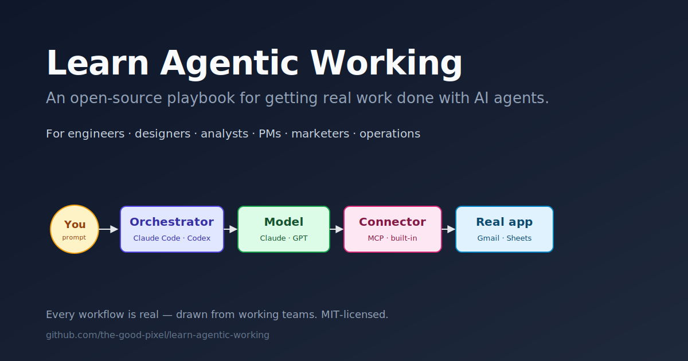

# Learn Agentic Working

> **An open-source playbook for getting real work done with AI agents.**
> For engineers, designers, analysts, PMs, marketers, operations — anyone whose work touches a computer.

[**📖 Read the book →**](https://the-good-pixel.github.io/learn-agentic-working/) · [Start with Ch. 1](https://the-good-pixel.github.io/learn-agentic-working/en/part-1-foundations/chapter-01-what-changes-when-ai-can-act/) · [10-minute first win](https://the-good-pixel.github.io/learn-agentic-working/en/part-1-foundations/chapter-04-a-10-minute-first-win/)

---

You've already chatted with ChatGPT or Gemini. You've asked it questions, copy-pasted answers, maybe drafted an email.

That's the **chatbot** mode. The AI talks; you do.

There's a different mode now: the **agent** mode. You tell it what you want done, and *it does it* — reads your files, runs commands, opens browsers, sends emails, queries databases, picks up where it left off.

This book is about that mode. Not the theory of it — the daily practice of it.

## Who this is for

- **Engineers** who want to stop typing every line — delegate feature work, bug hunts, refactors, code review.
- **Data and analytics folks** turning raw spreadsheets and warehouse queries into one-prompt outputs.
- **PMs and designers** shipping artifacts (PRDs, demo videos, prototypes) without waiting on a dev for each one.
- **Business and ops** — sales, support, finance, HR, legal — automating the inbox-spreadsheet-report grind.
- **Anyone** using the same agent on their own life: bills, travel, learning, the screenshot of their stock portfolio.

**Prerequisites:** you've used a chat AI like ChatGPT, Gemini, or Claude.ai. That's it.

## What makes this book different

- **Cross-audience.** Same playbook for engineers *and* non-engineers — most books pick one. Part V splits into role-specific chapters so each reader gets a workflow that matches their day.
- **Every workflow is real.** Examples are paraphrased from actual working teams — no invented toy tasks.
- **Tool-neutral.** Claude Code is the primary running example because that's what the author uses daily, but every chapter cites the equivalent in Codex, OpenCode, Cursor, and Gemini CLI.
- **Free, MIT-licensed, open to contribution.** Use it, fork it, run an internal training off it, translate it.

## The three throughlines

If you forget every specific pattern in this book and you remember these three, you'll figure out the rest as the tools change:

1. **If you can describe it, ask the agent to do it — including the setup.** You won't be asked to write code, edit configs, or install anything by hand.
2. **Equip first, then engage.** Before starting any task in a new domain, ask *"what MCPs and skills exist for the tools involved? Install them."*
3. **Monitor, don't block.** Let the agent take real action by default and watch what it does, rather than gating every step. The exception is the small set of *big and irreversible* actions.

## Book structure

Six parts, 28 chapters, four appendices. Each chapter is standalone, ~2,000–2,500 words, with a "try it yourself" exercise.

- **I — Foundations.** What an agent is, the architecture diagram, the 10-minute first win.
- **II — Setup once.** Install, trust, `CLAUDE.md`, MCP servers.
- **III — Working with an agent.** Equipping, context, output forms, reviewing, parallel work.
- **IV — Skills.** When to stop re-prompting and write one.
- **V — Workflows by audience.** Role-specific chapters: engineers, data, PMs/designers, business/ops, everyone-personal.
- **VI — Going further.** Voice/vision input, browser-driving, running responsibly, what we got wrong.

→ [**See the full table of contents on the site**](https://the-good-pixel.github.io/learn-agentic-working/)

## Contributing

Pull requests welcome — especially:

- **Real workflow stories** (the prompt, the outcome, what surprised you).
- **Tool parity notes** — *"Codex/OpenCode also does this, but…"*.
- **Translations** and audience adaptations (e.g., "for accountants", "for lawyers").
- **Corrections** when a tool's behavior changes — agent tooling moves fast.

Open an issue or a PR. No CLA.

## Inspirations

Structurally modeled on [Learn Harness Engineering](https://github.com/walkinglabs/learn-harness-engineering) by Walking Labs — short, opinionated, scenario-led chapters with hands-on exercises. If you like the shape of this book, you'll like that one too (different topic).

## License

MIT. See [LICENSE](LICENSE).
