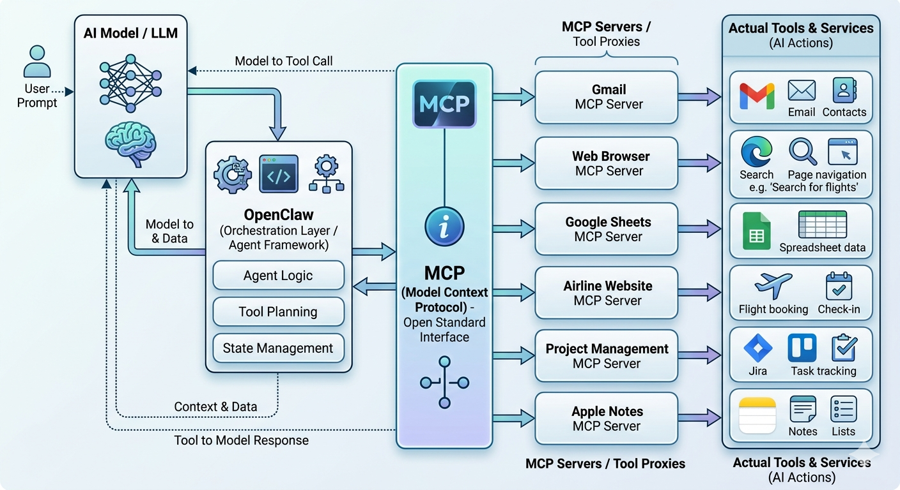

# 2. How does an agent actually work?

The eight emails went out. It's 10:03 PM. You're still on the couch, a little stunned at how quick that was, and a little suspicious. *How did it actually do that?* You typed one sentence. Three minutes later, eight emails were sent, with the right addresses, referencing the right conversations, signed off the way you usually sign off.

You didn't see a single tab open. You didn't watch a cursor move. From your seat it just *happened*.

It's worth slowing down and pulling that apart, because the rest of this book leans on the answer. Once you can see the moving parts, every chapter from here on — skills, MCPs, sub-agents, scheduled work — clicks into place. They're all variations on the same five-box picture.

## The picture

Here's the entire model. Burn this into your head, because it is the only diagram you really need:



In one line:

```
You  →  the Model  →  the Orchestrator  →  the Connectors (MCPs)  →  your real apps
```

Read left to right: a sentence from you flows into a language model, which thinks about what to do, which hands instructions to a piece of software running on your computer, which calls out to one or more connectors that know how to talk to specific apps, which then actually do the things — read your inbox, write a row in a sheet, open a browser, send a message.

Each box has a job. Let's walk them.

## Box 1: you

You write a sentence. Sometimes a paragraph. Occasionally you drop in a screenshot or a file. That's it. Your job in the loop is to *decide what should happen* — and to **watch** as it happens.

That sounds trivial; it isn't. The quality of what comes back is mostly a function of how clearly you said what you wanted. The book spends an entire chapter on this (Ch. 10), but the short version is: brief the agent like you'd brief a smart colleague who just walked into the room. Give it the context it doesn't already have. Show, don't just tell. A screenshot beats a paragraph of description nine times out of ten.

## Box 2: the Model

The Model is the **brain**. It is the part you already know — GPT-5, Claude, Gemini, whichever underlying large language model your agent is built on. It reads your sentence and the surrounding context and produces words. That's all an LLM does, fundamentally: predict the next batch of words.

What's new is *what* it's now writing. In chatbot mode, it writes an answer for you to read. In agent mode, it writes one of two things:

1. **An answer** — the same as before, when an answer is what you needed.
2. **A tool call** — a tiny structured instruction that says *"call the Gmail connector and send this email to this address"* or *"open the file `notes.txt` and read it back to me"*.

The model doesn't *do* anything itself. It doesn't have hands. It writes either prose for you, or a request for something else to act on its behalf. The model is the part that decides; everything to its right is the part that executes.

This matters because it explains why agents from different vendors feel similar. Underneath, they're all the same shape — a language model that can either talk or call a tool. The personality varies. The shape doesn't.

## Box 3: the Orchestrator

The Orchestrator is the **piece of software running on your machine** (or in some cases, in a vendor's cloud) that wraps the model. When you launch Claude Code in a terminal, or Codex, or OpenCode, you are running the orchestrator. The orchestrator is the body to the model's brain.

Its job is the boring, important glue:

- Take your sentence, package it with relevant context (your project files, recent screenshots, prior conversation), and send it to the model.
- Read what the model writes back. If the model wrote prose, show it to you. If the model wrote a tool call, route that call to the right connector.
- Take the result, hand it back to the model so it can think about the next step, and loop.
- Manage memory: what's been said, what's been done, what should be forgotten when the context window fills up.

The loop in step three is what makes an agent feel different from a chatbot. A chatbot does *one* round-trip — your sentence in, model's answer out. An agent runs a loop: model thinks, model calls a tool, tool returns a result, model thinks again, model calls another tool, repeat until done.

You will hear this loop called many things: the "agent loop", the "ReAct loop", the "tool-use loop". They all mean the same thing.

## Box 4: the Connectors (MCPs)

Here is the part that's genuinely new, and the part that gives this book half its vocabulary.

The Model can write *"call the Gmail connector"*. But how does it know *what* Gmail can do, what arguments to pass, what format the response comes back in? Someone has to write a piece of software that bridges *generic instructions from a language model* to *specific calls to the Gmail API* — and that bridge has to be in a format the model can read.

That bridge is called an **MCP server**. MCP stands for **Model Context Protocol** — an open standard, originally published by Anthropic in late 2024, that defines a shared language for "here is a tool the model can call". Once a tool speaks MCP, *any* MCP-capable agent — Claude Code, Codex, OpenCode, Cursor, Gemini CLI — can use it.

For the purposes of this chapter, think of an MCP server as **an app installed on your agent's phone**. Each MCP gives the agent one new capability:

- Install the **Gmail MCP** → the agent can read and send mail.
- Install the **GitHub MCP** → it can open PRs, read issues, comment on diffs.
- Install the **Linear MCP** → it can create and update tickets.
- Install the **filesystem MCP** → it can read and edit files on your machine (this one usually ships built-in).
- Install the **Shopify, Stripe, Notion, Slack, Google Sheets MCPs** → and so on.

You don't install these by editing JSON. You ask the agent: *"install the Gmail MCP and connect it to my Google account."* The agent does the install, walks you through the one-click sign-in, confirms it works. That's the throughline from Ch. 1 — *if you can describe it, you can ask the agent to do it, including the setup*. Ch. 9 is the full tour of which MCPs to install on day one and how to ask.

A note on the word "tool". In agent-land, **tool** is used two ways: the *capability* the model can call, and the actual SaaS or service behind it. We try to say *"the agent calls the Gmail tool, which is provided by the Gmail MCP server, which calls Gmail itself."* When the distinction matters, we'll be explicit.

## Box 5: your real apps

The last box is the easy one — it's the apps you already use. Gmail. Notion. Shopify. Your filesystem. Your bank's website. Whatever the connector talks to.

The agent doesn't *replace* these. It *uses* them, the same way you do. This is the heart of Ch. 5: you keep the systems of record; you just stop opening their windows yourself.

## Replaying 9 PM through the diagram

Let's run the conference-emails scenario from Ch. 1 through this picture.

You type: *"Find the eight people I exchanged business cards with today, draft a warm follow-up for each one referencing what we talked about, and send them all from my Gmail."*

1. **You → Model.** The orchestrator packages your sentence and ships it to the model.
2. **Model writes a tool call.** Something like *"call the filesystem MCP, list image files added to `~/Photos/` today"*.
3. **Orchestrator → MCP → Real app.** The filesystem MCP returns a list of eight photos.
4. **Result goes back to Model.** It writes another tool call: *"call the vision tool, extract text from these eight photos"*. Names, titles, companies, emails come back.
5. **Model writes another tool call.** *"Read `~/Notes/conference.txt`"*. Your scribbled notes come back.
6. **Loop.** The model now has the names and the notes. It drafts eight emails. It calls the Gmail MCP for each: *"send this draft to this address"*.
7. **You watch.** The orchestrator streams every step to your screen as it happens. You see the photos being read, the notes being read, the drafts being composed. When the drafts are ready, you can preview before they send (or not — that's a permissions choice, covered in Ch. 7).

Five boxes. One loop. Eight emails out the door.

## Why this picture matters

Every advanced pattern in this book is a variation on this diagram:

- A **skill** (Ch. 17–19) is a named, reusable *recipe* that lives in the orchestrator and tells it "when the user asks for X, run this sequence of model + tool steps." It is the orchestrator's playbook.
- A **sub-agent** (Ch. 14) is a second copy of the loop, spun up alongside the first, doing its own model-plus-tools work in parallel.
- A **long-running agent** (Ch. 14) is the same loop, left to run on its own for an extended task.
- A **hook** is a rule in the orchestrator that says "when X happens in the loop, also run Y."

When you read about any of these later, come back to the diagram and ask: *which box is this changing?* The answer is always one of the five.

## In other tools

Claude Code, Codex, OpenCode, Cursor, Gemini CLI — all five are orchestrators sitting on top of a model and speaking MCP. They differ in defaults, in how they show the loop, in which model they default to, and in their permission UX. They do not differ in the diagram. If you switch tools next year, you'll have to relearn the keybindings; you will not have to relearn this picture.

## The takeaway

- One sentence, five boxes: **you → Model → Orchestrator → MCP connectors → your apps**.
- The Model decides. The Orchestrator runs the loop. The Connectors are how the loop reaches the world. Your apps are the world.
- The new vocabulary — MCP, tool call, the loop — all maps to a specific box. When a concept feels fuzzy, ask which box it lives in.
- Skills, sub-agents, schedules, hooks, custom MCPs: all of them are variations on this same picture.

## Try it yourself

Open whatever AI chat app you currently use (ChatGPT, Claude.ai, Gemini). Ask it:

> *"Without code, walk me through what would have to be true for you to read the last five emails in my Gmail and summarize them."*

Read the answer. Notice how it has to explain — even though it can't actually do it from a chat window — that it would need *access to Gmail*, that *something would have to call the API*, that there would be a *back-and-forth*. That answer is the diagram from this chapter, in the chatbot's own words.

**You'll know it worked when** you can point at three different pieces of that explanation and say which box of the five-box diagram each piece lives in.

## What's next

Now that you know the shape of an agent, the next chapter is a quick tour of the actual tools you can install today — terminal agents, IDE agents, browser agents — and what each is genuinely good at. If you'd rather skip the landscape and just install one and run a task, jump to **Ch. 4: A 10-minute first win**.
